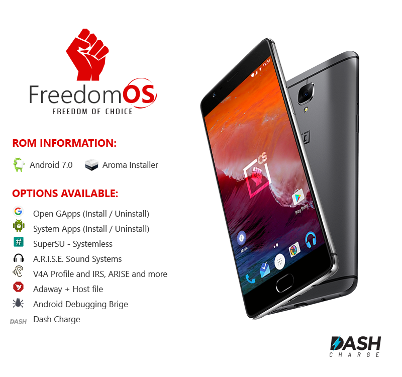

# FreedomOS



## Note for pull requests and issues

I refuse all pull requests and issues coming from Github, use [Gitlab](https://gitlab.com/Nevax/FreedomOS).

## Required
- Linux x64 (others architectures are not currently supported).
- 30GiB of free space or more.
- Packages : `rsync python python2 zip curl openssl ncurses cpio python-virtualenv`
- Python version 3 is needed.
- Optional packages:
- `adb` for pulling updated apps and pushing rom with automatic flash.
- `java` for signed the zip file.

## How to build

Clone the repo:
```bash
git clone https://gitlab.com/Nevax/FreedomOS.git -b master
```
Get needed repos:
```bash
bash ./update_repos.sh
```
Build the project:
```bash
bash build.sh
```

It will download all the needed files (~1.4GiB) and start building your project.
Once you have the needed files, you don't need to re-download them.

## Join the beta team
We use Slack, just send me your email address in private message on XDA and i will send your an invitation to join the team.

Check your email.

[XDA thread](http://forum.xda-developers.com/oneplus-3/development/rom-freedomos-1-0-t3409348)
